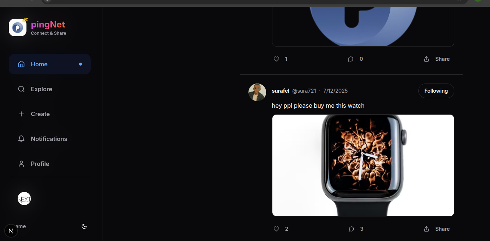

# ⚡️ PingNet

> **A modern, full-stack social media platform to connect, create, and share.**

 

---

<p align="center">
  
</p>

---

## ✨ Features

✅ **Fast, Server-First Architecture** – Built with Next.js App Router, server actions, server components, and streaming.  
✅ **Secure Authentication** – User sign-up/sign-in with [Clerk](https://clerk.dev).  
✅ **Rich Content Creation** – Posts with text, hashtags, mentions, and images via [Tiptap](https://tiptap.dev) and [UploadThing](https://uploadthing.com).  
✅ **Explore & Search** – Real-time, debounced search for users and hashtags.  
✅ **Interactive Feed** – Like, comment, follow, unfollow with optimistic UI.  
✅ **Notifications** – Stay updated on likes, comments, and followers.  
✅ **Dark/Light Mode** – Seamless toggle with persistence.  
✅ **Professional Loading UX** – Skeletons, Lottie animations, and top-loader for smooth experience.  
✅ **Responsive Design** – Mobile-first, clean, and modern UI with Tailwind and shadcn/ui.

---

## 🛠️ Tech Stack

| Category               | Technology                                 |
|------------------------|--------------------------------------------|
| **Framework**          | Next.js (App Router)                      |
| **Language**           | TypeScript                                |
| **Styling**            | Tailwind CSS + shadcn/ui                  |
| **Database**           | PostgreSQL (Neon/Supabase)                |
| **ORM**                | Prisma                                    |
| **Authentication**     | Clerk                                     |
| **File Uploads**       | UploadThing                               |
| **Rich Text Editor**   | Tiptap                                    |
| **Animations**         | Lottie                                    |
| **Forms & Validation** | React Hook Form + Zod                     |
| **Icons**              | lucide-react                              |
| **Notifications**      | sonner                                    |

---

## 🚀 Live Demo

🌐 [PingNet Live](https://pingnet-media.vercel.com)  

---

## 🚀 Getting Started

### Prerequisites

✅ Node.js `v18+`  
✅ pnpm, npm, or yarn  
✅ PostgreSQL database (Neon/Supabase/local)  
✅ Clerk account  
✅ UploadThing account

---

### 1️⃣ Clone the Repository

```bash
git clone https://github.com/sura721/codeAlpha_socialMedia.git
cd pingNet
```
# -------------------------------------
# 🌿 DATABASE (PostgreSQL via Neon)
# -------------------------------------
DATABASE_URL=""

# -------------------------------------
# 🔑 Clerk Authentication
# -------------------------------------
NEXT_PUBLIC_CLERK_PUBLISHABLE_KEY=""

CLERK_SECRET_KEY=""

NEXT_PUBLIC_CLERK_SIGN_IN_URL=""

NEXT_PUBLIC_CLERK_SIGN_IN_FALLBACK_REDIRECT_URL=""

NEXT_PUBLIC_CLERK_SIGN_UP_FALLBACK_REDIRECT_URL=""

# -------------------------------------
# 📦 UploadThing (File Uploads)
# -------------------------------------
UPLOADTHING_SECRET=""

UPLOADTHING_APP_ID=""

UPLOADTHING_MAX_CALLBACK_WAIT_MS=

UPLOADTHING_TOKEN=""

 
# -------------------------------------
# ⚡ Inngest (Background Jobs & Webhooks)
# -------------------------------------
INNGEST_EVENT_KEY=""

INNGEST_SIGNING_KEY=""


# Set Up the Database
npx prisma db push

npx prisma generate

## 🤝 Acknowledgments
# 💡 Built using:

Next.js

Clerk

Prisma

UploadThing

Tiptap

Vercel

Inngest

<p align="center">  </p>
🚀 Made with ❤️ by Surafel Admas
